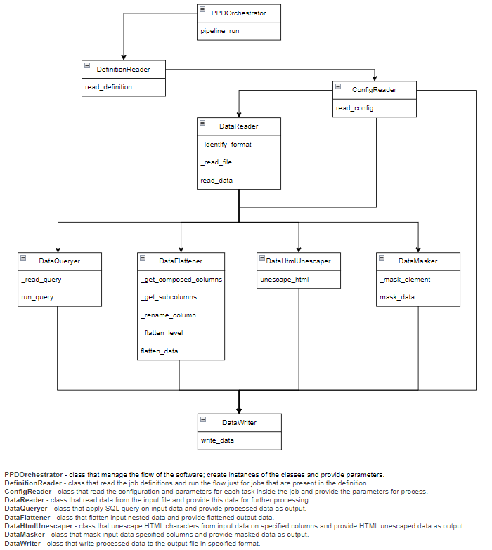

# PyProcData


[](https://opensource.org/licenses/MIT)
[](https://github.com/romanmurzac/pyprocdata/actions)

## Description

PyProcData is a Python application that allows users to process data by applying transformations such as flattening nested dictionaries, unescape HTML characters, and masking sensitive information. The processed data can be stored or provided as a downloadable file.

## Features

- **Process**: Process data using SQL queries.
- **Flatten**: Convert nested structure to a flat structure.
- **HTML Unescape**: Convert HTML entities to their corresponding characters.
- **Mask**: Mask sensitive information in strings.

## Table of Contents

- [Installation](#installation)
- [Configuration](#configuration)
- [Usage](#usage)
- [Contributing](#contributing)
- [License](#license)
- [Contact](#contact)

## Installation

### Prerequisites

- Python 3.11 or higher

### Install
Clone the repository:
```
git clone https://github.com/romanmurzac/PyProcData.git
```
### Create virtual environment
Create virtual environment and activate it:
```
python3 -m venv venv
souce venv/bin/activate
```

Install dependencies
```
pip install -r requirements.txt
```

### Run Test
Tests run:
```
pytest tests/  
```

Tests coverage:
```
pytest --cov=src --cov-report=term-missing
```

## Configuration
```
PyProcData
├───.github
│   └───workflows
├───docs
├───logs
├───ppd_definitions
│   ├───sample_1
│   └───sample_2
├───process_data
│   ├───source_data
│   └───target_data
├───pyprocdata
│   └───all_code
├───tests
│   └───all_tests
├───.gitignore
├───LICENSE
├───pyproject.toml
├───README.md
├───requirements.txt
└───setup.cfg
```

Directories:
- `.github/workflows/` → Contains GitHub Actions CI/CD workflows.
- `docs/`              → Stores documentation for the project.
- `logs/ `             → Stores log files generated during data processing.
- `ppd_definitions/`   → Contains configuration files or metadata for processing.
- `process_data/`      → Directory where data processing happens:
  - `source_data/`     → Raw input files before processing.
  - `target_data/`     → Processed output data after transformation.
- `pyprocdata/`        → The main package (library) of the project.
- `tests/ `            → Contains unit and integration tests.

Files:
- `.gitignore`       → Specifies files and folders that Git should ignore.
- `LICENSE`          → Defines the project's license type.
- `pyproject.toml`   → Main configuration file for the Python project.
- `README.md`        → Project documentation.
- `requirements.txt` → List of Python dependencies.
- `setup.cfg`        → Configuration file for setuptools.


## Usage

1. Job definition
Provide the job name to be executed. All the jobs name that will be provided in the definition will be executed.\
In the `pdd_definitions` directory create a directory for your job (e.g. *sample_1)* and in the `job_definitions.json` file add your job name.\
***Example:***
```
[
  {
    "job_name":"sample_1"
  },
  {
    "job_name":"sample_2"
  }
]
```

2. Job config
Inside the directory of the new job that was created in previous step create `config.json` file and define the structure from below.\
***Example***
```
[
  {
    "source_file": "source_data.csv",
    "target_file": "target_data.csv",
    "transformation": "transformation.sql",
    "processes": {
      "transformation": true,
      "flattening": true,
      "html_unescape": [
        "column_3"
      ],
      "masking": [
        "column_1",
        "column_2"
      ]
    }
  }
]
```

`source_file`    --> file name of the source data.\
`target_file`    --> file name of the destination data.\
`transformation` --> SQL query to be applied to process data if option `processes/transformation : true`.\
`transformation` --> `true` if SQL processing is needed, otherwise `false`.\
`flattening`     --> `true` if flattening is needed, otherwise `false`.\
`html_unescape`  --> list of columns for which to apply HTML unescape processing.\
`masking`        --> list of columns for which to apply masking processing.\

If SQL processing is required create a `sql` file according to the name provided in the *config.json* file.\
***Example***
```sql
SELECT
    *
FROM
    dataframe
LIMIT 4
```

3. Source data
Provide data to be processed in the `process_data/source_data`. After processing the output data will be available in the `target_data` directory.

## Code logic
The framework logic is presented in the image below.\
